```{r setup, include=FALSE}
knitr::opts_chunk$set(echo = FALSE)
```

## WARNING!!!

I am NOT a Git/Github expert!

<center>

<div class="tenor-gif-embed" data-postid="21632152" data-share-method="host" data-width="40%" data-aspect-ratio="1.0"><a href="https://tenor.com/view/im-no-expert-saturday-night-live-im-not-apro-im-not-an-expert-iam-not-that-expert-with-it-gif-21632152">Im No Expert Saturday Night Live GIF</a> from <a href="https://tenor.com/search/imnoexpert-gifs">Imnoexpert GIFs</a></div><script type="text/javascript" async src="https://tenor.com/embed.js"></script>

</center>

## But I want to learn!

* I want to share code with others so they can use it.  
* I want my code backed up somewhere other than on my computer.  
* I hate keeping track of different versions of code and other files.  
* I also hate the terminal so will try to avoid it at any cost.

Git/Github can help us with this! How many of you already use Github? 

## Why learn this from me?

* Git/Github were really intimidating to me at first - they still are!  
* I didn't feel like I had a place where I could try things out and make mistakes.  
* When things didn't work out the way they showed in online resources, I had no idea what to do!  

I hope to give you a comfortable format to try things and learn. Please, ask questions and interrupt when I do something too quickly or that you don't fully follow. There are no stupid questions!


## What we should already have set up

* Created an account on https://github.com/.
* Install and configure git - I have basic instructions here: https://github.com/llendway/github_for_collaboration/blob/master/github_for_collaboration.md#install--configure-git (I'll share this in the chat).  
* Set up a PAT (personal access token) - see the previous link.  
* In R Studio, install the following packages: usethis (for nice interactions with Git/Github) and gitcreds (if you haven't yet set up a PAT, there's some functions in here that help) ... I think that's it. I'm going to keep the R code REALLY simple.


## Review of the Git/Github with R Project basics 

For images and more detail, see: https://github.com/llendway/github_for_collaboration/blob/master/github_for_collaboration.md

1. Create repo on https://github.com/, checking the box to add a README and probably add a license (I usually choose MIT but do not trust me to explain any of the legality of this).  
2. Clone the repo to your computer: click the green code button and copy the link, in R Studio File --> New Project --> Version Control --> Git --> Paste link and put it in the desired location.  
3. Stage, Commit, and Push the .Rproj file.  
4. Add a new .Rmd file and stage, commit, and push that.

We will do these steps together!

## Adding a collaborator

Now, let's explore how we can work with others on a project by adding a collaborator.

1. On https://github.com/, go to your repository page for the repository you just created. 
2. Choose Settings (the gear-like icon).  
3. Go to Manage access. 
4. Search for your collaborator's Github account and choose Invite a collaborator.  
5. They will get an email and must accept your invitation to collaborate. 
6. Once accepted, they will have equal access to everything in the repository.  
7. They should clone the repo to their computer. Make sure the initial person creates the Rproj first, otherwise you can run into weird issues.

## Adding a collaborator

Let's do this together! Would someone volunteer to be my collaborator?

## Adding a collaborator

Once we have our collaborator(s), we'll add some steps to our usual process. 

* When we reopen the project, Pull in new work! (the turquoise down arrow on the Git tab).
* Communicate!!! Talk to your collaborators about what you're working on and when. You'll likely run into issues if you all are collaborating on the same file at the same time. 

Which brings us to ....

## Merge conflicts! Arg!

If you and a collaborator are working on a file at the same time, you'll likely run into a merge conflict at some point. This means you've tried to push out new work, but in the mean time a collaborator has already pushed out more new work that you hadn't pulled in. Sometimes Git can resolve them on its own but often it can't.

When that happens, you need to resolve it by editing the file where the merge conflict occurred. You can see details of how to do that here: https://github.com/llendway/github_for_collaboration/blob/master/github_for_collaboration.md#merge-conflicts

Let's create a merge conflict together!

## Branching

According to Github [documents](https://docs.github.com/en/github/collaborating-with-pull-requests/proposing-changes-to-your-work-with-pull-requests/about-branches) (which I probably should read more of), "Branches allow you to develop features, fix bugs, or safely experiment with new ideas in a contained area of your repository." 

You can experiment in a branch and then later merge it with your "main" branch (or with another branch). 

This can be a safer way to collaborate with others.


## Branching

Let's add a branch (we'll do this together in a moment).

Click on the "branch" in the Git tab.  


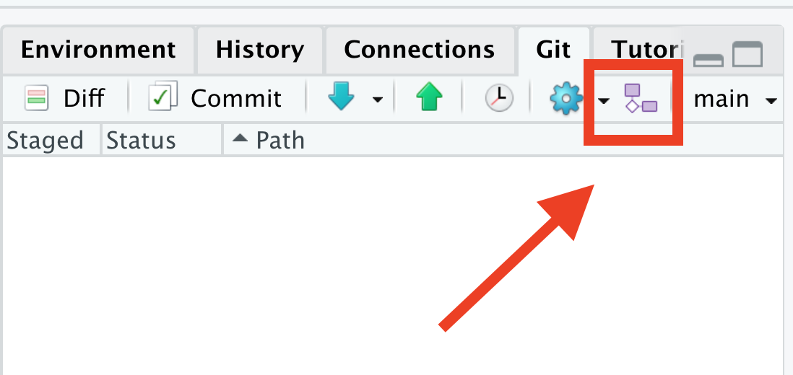{width="50%"}


## Branching

Give it a name and create. You'll see this after you do. 

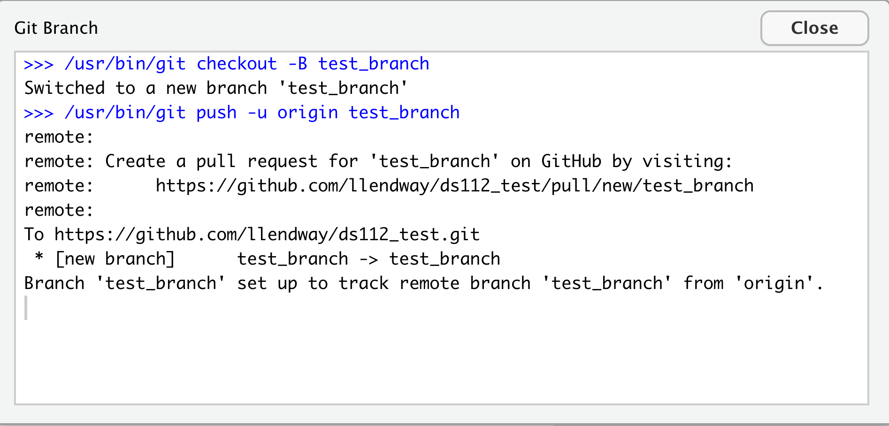{width="50%"}

You can also see the new branch on Github. Let's do these steps together.

## Branching

Now that we have a branch, let's use it. Make a change to a file in the new branch (we'll just use the README). Commit and push the changed file. On Github, you'll see a message like this:

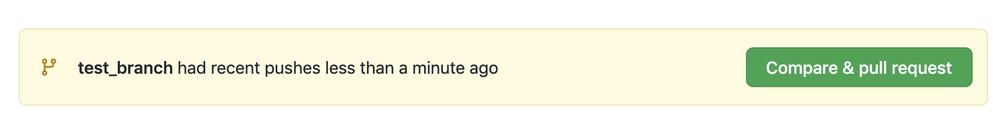{width="90%"}

If I'm collaborating, the collaborator can pull in changes to see the new branch. 

Let's do this together. Make a few commits and pushes.


## Branching - merging to main

Once we are satisfied with the work we did in our branch, we'll want to merge it back to the main branch. Go out to Github and click on the Compare & pull request button in the new branch. This is creating a pull request - asking someone (in this case yourself) to pull in the changes you're about to merge. Fill in the fields and click Create pull request.

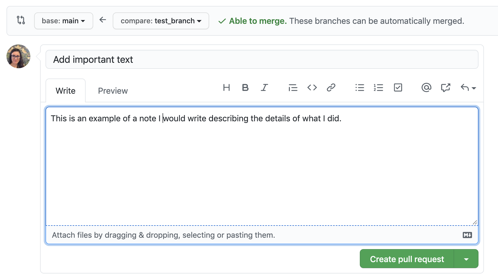{width="50%"}

## Branching - merging to main

I could keep making changes, committing, and pushing. If I'm finished, and since I didn't make any difficult changes, it can be merged automatically - this won't always be the case.

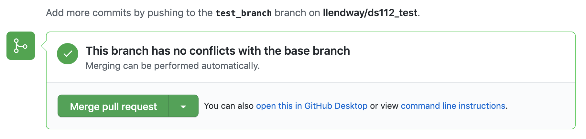{width="90%"}

Click Merge pull request.

## Branching - merging to main w/ conflict

What if I (or my collaborator) made changes to the same file in the main branch, while I was making changes to it in the new branch? We'll have a merge conflict to resolve! Let's see those steps. First, we each make our changes and save, commit, and push.

<div class="columns-2">
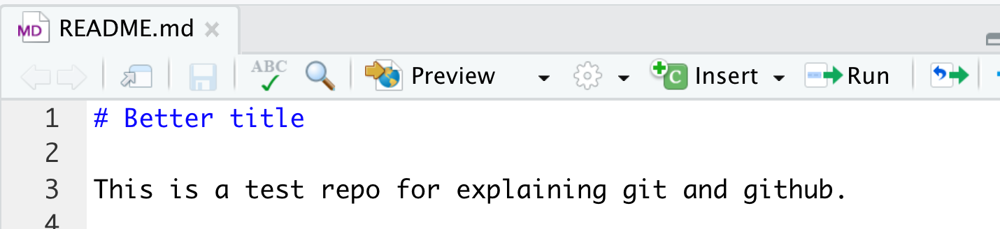{width="90%"}

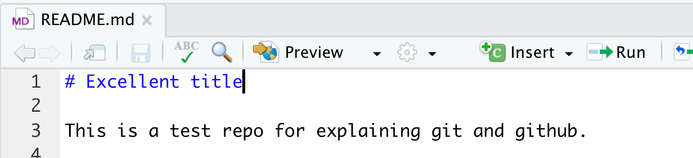{width="90%"}

</div>


## Branching - merging to main w/ conflict

In Github, click on the Compare & pull request button. This time, you'll see a screen like this - notice the red X message. Still click create pull request.

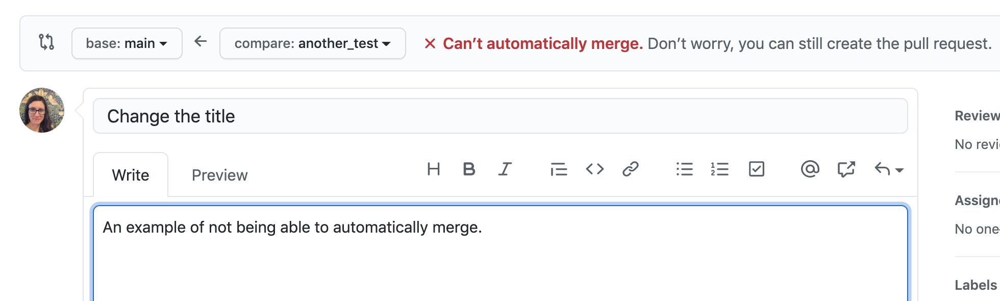{width="70%"}

## Branching - merging to main w/ conflict

On this screen, you can click the Resolve conflict button.

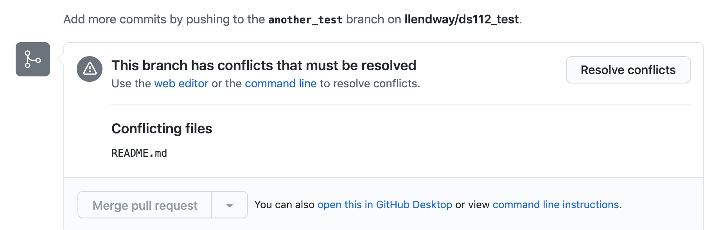{width="70%"}

## Branching - merging to main w/ conflict

An editor will open where you can make changes ... in this case, it's pretty easy to do it here, but I imagine this could get pretty complicated. I guess that's a good reason to do small steps in the branches so you don't run into those :)

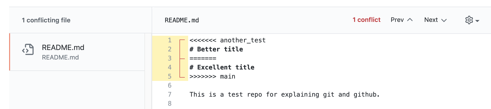{width = "70%"}
## Branching - merging to main w/ conflict

Resolve the conflict and click Mark as resolved. Now you should be able to merge pull request as before and follow to the next steps as if you didn't have a merge conflict!

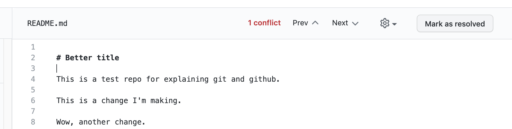{width="70%"}

## Branching - merging to main

Confirm that you really do want to merge the new branch with the main branch.

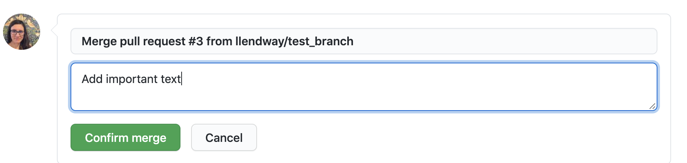{width="90%"}

## Branching - merging to main

If you don't need the branch anymore, you can delete it. 

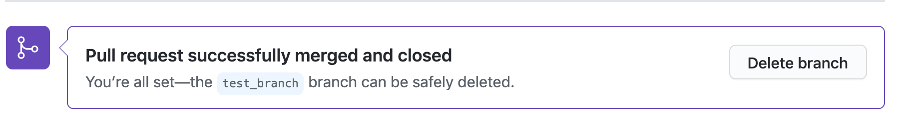{width="90%"}

Then, go back to R Studio and pull in the changes, from the main branch.Note that it still shows up in R Studio so be careful you don't do work there (I can't figure out how to get rid of it).

## Pull requests (PRs)

Once you're comfortable using these tools on your own and with some trusted collaborators, you may want to start making suggestions to other people's code - maybe add a feature in your favorite package or even just suggesting a typo fix in some documentation. That's a pull request! 

We are going to use the instructions here: https://usethis.r-lib.org/articles/articles/pr-functions.html

And we're going to make pull requests to a PR practice repo I created: https://github.com/llendway/pr_practice

## Pull requests (PRs)

We will need to load the usethis library. You should also have the gert and credentials packages installed.

```{r}
library(usethis)
```


## Pull requests - fork and clone

You are going to fork and clone the repo. Forking is putting it in your own Github repo and cloning it puts it on your computer. This function also sets the upstream remote to the original repo (mine, in this case) so you 

```{r}

```


## Pull requests (PRs)


## Pull requests (PRs)


## Pull requests (PRs)


## Resources

These slides: https://github.com/llendway/rladies_github_for_collab

My blog post, with video (thank you to my sister, Heather): https://lisalendway.netlify.app/posts/2021-02-24-gitinrstudio/

Happy Git with R by Jenny Bryan: https://happygitwithr.com/ - an amazing resource, especially after you're a little more comfortable with using Git and Github

The usethis Pull request helpers article: https://usethis.r-lib.org/articles/articles/pr-functions.html


